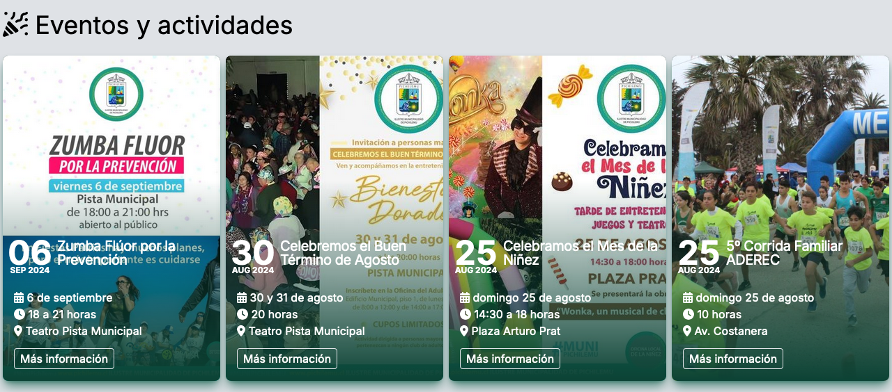
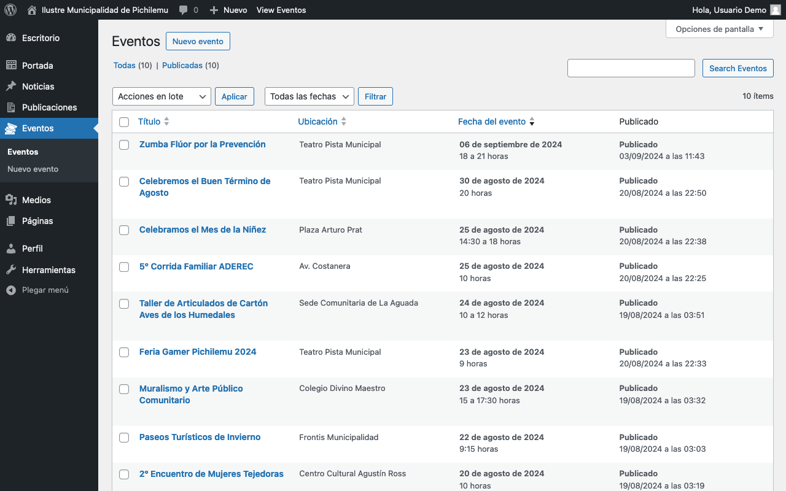
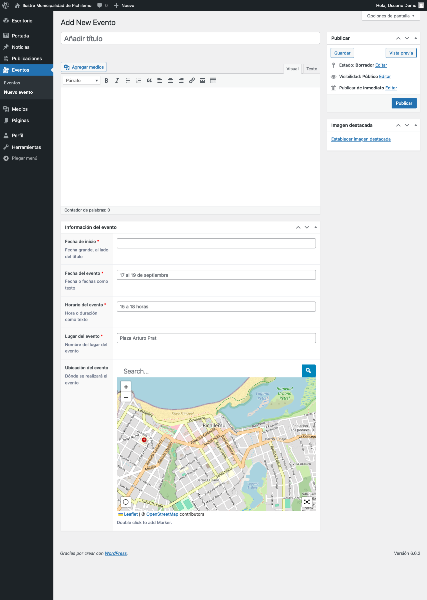

# Eventos

<figure><figcaption>
Visualización de los eventos más próximos en la página principal
</figcaption></figure>

El panel de administración de este elemento se encuentra en la barra lateral, bajo _Eventos_.

<figure><figcaption>
Mantenedor de eventos en el panel de Wordpress
</figcaption></figure>

## Agregar Evento

Para agregar un nuevo Evento, sigue estos pasos:

1. Ve a _Eventos > Nuevo evento_ en el panel de administración.
2. Se abrirá el formulario para crear un nuevo evento.

<figure><figcaption>
Formulario de edición de un nuevo evento
</figcaption></figure>

### Campos específicos

#### Título

* **Descripción**: El nombre o título del evento.
* **Uso**: Introduce un título descriptivo y atractivo en el campo _Añadir título_.

#### Contenido

* **Descripción**: La descripción detallada del evento.
* **Uso**: Utiliza el editor de texto enriquecido para añadir información sobre el evento. Puedes incluir texto formateado, listas, enlaces e incluso medios utilizando el botón _Agregar medios_.

#### Fecha de inicio

* **Descripción**: La fecha en que comienza el evento.
* **Uso**: Introduce la fecha en el campo _Fecha de inicio_.
* **Notas**:
  * Esta fecha se mostrará de manera prominente junto al título del evento.
  * La fecha indicada en este campo es la que se utilizará para ordenar los eventos en el tiempo.

#### Fecha del evento

* **Descripción**: La fecha o fechas en las que se desarrolla el evento, como texto.
* **Uso**: Introduce el rango de fechas en el campo _Fecha del evento_.
* **Ejemplos**:
  * "12 de octubre"
  * "17 al 19 de septiembre"

#### Horario del evento

* **Descripción**: La hora u horas en que se llevará a cabo el evento, como texto.
* **Uso**: Introduce el horario en el campo _Horario del evento_.
* **Ejemplos**:
  * "13 horas"
  * "15 a 18 horas"
  * "9 a 12 y 14 a 18 horas"

#### Lugar del evento

* **Descripción**: El nombre del lugar donde se realizará el evento.
* **Uso**: Introduce el nombre del lugar en el campo _Lugar del evento_.
* **Ejemplo**: "Plaza Arturo Prat"

#### Ubicación del evento

* **Descripción**: La ubicación exacta del evento en un mapa interactivo.
* **Uso**:
  1. Utiliza la barra de búsqueda para encontrar la ubicación.
  2. Ajusta el mapa arrastrándolo con el mouse.
  3. Haz doble clic en el mapa para añadir un marcador en la ubicación exacta.
* **Nota**: Puedes acercar o alejar el mapa usando los botones "+" y "-" o el scroll del mouse.

#### Imagen destacada

* **Descripción**: Una imagen representativa del evento.
* **Uso**: Haz clic en _Establecer imagen destacada_ en el panel lateral derecho para subir o seleccionar una imagen.
* **Recomendación**: Usa una imagen atractiva y relevante para el evento, preferiblemente de alta resolución.

## Consejos para un uso efectivo

1. Títulos claros y concisos: Asegúrate de que el título del evento sea descriptivo y fácil de entender.
2. Información completa: Incluye todos los detalles relevantes en el contenido del evento (descripción, requisitos de participación, etc.).
3. Fechas y horarios precisos: Verifica que las fechas y horarios sean correctos y estén en un formato consistente.
4. Ubicación exacta: Utiliza el mapa interactivo para marcar la ubicación precisa del evento, facilitando a los asistentes encontrar el lugar.
5. Imágenes atractivas: Usa imágenes de alta calidad que representen bien el evento o el lugar donde se realizará.
6. Actualización oportuna: Si hay cambios en el evento, actualiza la información lo antes posible.
