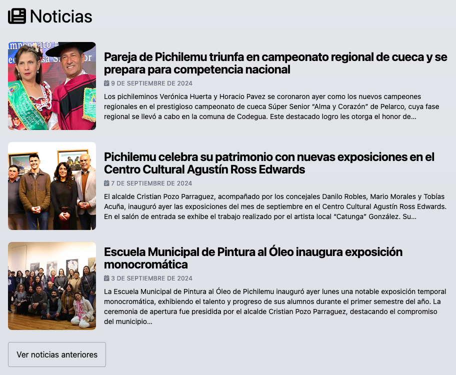
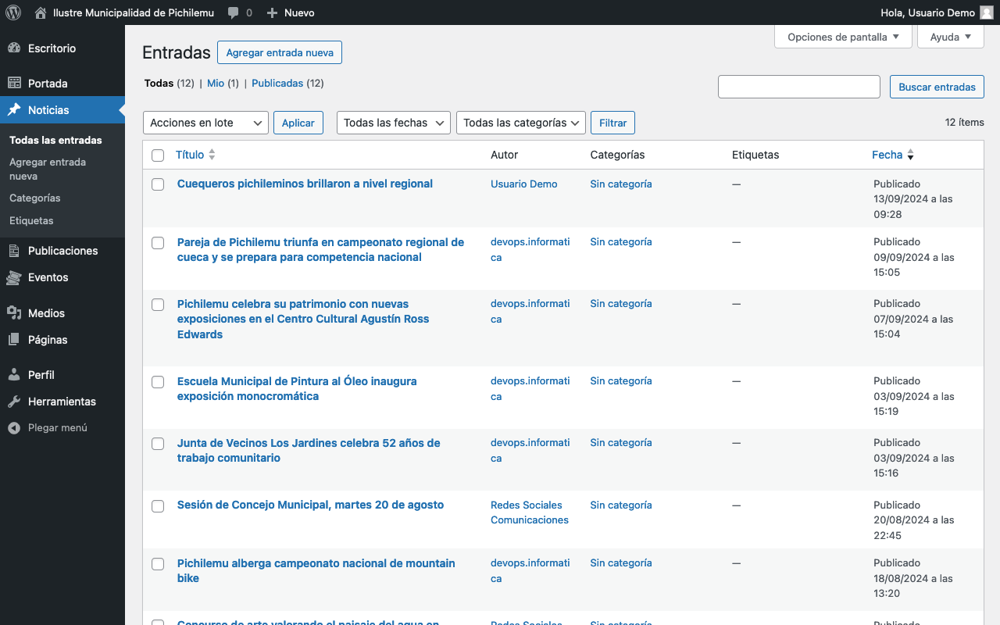
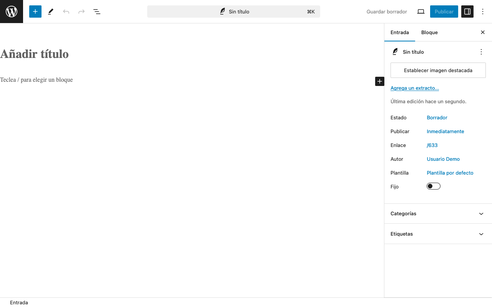
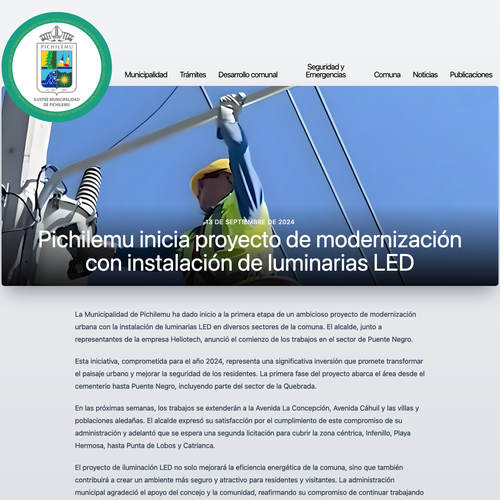

# Noticias

<figure><figcaption>
Listado de noticias en la página principal
</figcaption></figure>

El panel de administración de este elemento se encuentra en la barra lateral, bajo _Noticias_.

<figure><figcaption>
Listado de noticias en el mantenedor de Wordpress
</figcaption></figure>

## Agregar Noticia

Para agregar una Noticia, hay que presionar el botón _Añadir nueva_ en la sección Noticias del panel de administración.

<figure><figcaption>
Espacio de edición de una nueva noticia en el mantenedor de Wordpress
</figcaption></figure>

### Campos específicos

#### **Título**

* **Descripción**: Es el titular principal de la Noticia.
* **Uso**: Escribe un titular informativo y atractivo.
* **Recomendación**: Utiliza la capitalización correcta en los titulares. Capitaliza la primera palabra y los nombres propios, pero no cada palabra del título.

#### **Contenido**

* **Descripción**: El cuerpo principal de la Noticia.
* **Uso**: Utiliza el editor de WordPress para escribir y formatear el contenido de la noticia.
* **Recomendación**: Estructura el contenido con párrafos cortos y utiliza subtítulos para mejorar la legibilidad.

#### **Imagen destacada**

* **Descripción**: La imagen principal que acompaña a la Noticia.
* **Configuración**: Se establece a través de la sección "Imagen destacada" en el panel lateral derecho.
* **Recomendaciones**:
  * Usa una imagen de **al menos 1920×1280px**.
  * Ten en cuenta que en la vista de la noticia, la imagen tendrá una relación de aspecto de 128:45.
  * Lo más relevante de la imagen debe estar en el tercio central, ya que es lo que se verá principalmente.
* **Uso**: Haz clic en "Establecer imagen destacada" para subir o seleccionar una imagen.

#### **Categorías y Etiquetas**

* **Descripción**: Permiten clasificar y organizar las noticias.
* **Uso**: Selecciona las categorías apropiadas y añade etiquetas relevantes en los paneles correspondientes del lateral derecho.

## Gestión de Noticias

Para gestionar las noticias existentes:

1. Ve a _Noticias_ en el panel de administración.
2. Verás una lista de todas las noticias creadas.
3. Puedes editar, eliminar o ver rápidamente las noticias desde esta pantalla.

**Nota**: A diferencia de los elementos de la Portada, las Noticias no son reordenables manualmente. Se mostrarán en orden cronológico inverso (las más recientes primero) en el sitio web.

## Consejos para un uso efectivo

<figure><figcaption>
Vista de una noticia publicada
</figcaption></figure>

1. Títulos impactantes: Crea titulares que capten la atención pero que sean precisos y reflejen el contenido de la noticia.
2. Imagen destacada: Elige imágenes de alta calidad y relevantes para el contenido. Recuerda que lo más importante debe estar en el tercio central de la imagen.
3. Contenido estructurado: Usa párrafos cortos, subtítulos y listas para hacer el contenido más fácil de leer y escanear.
4. Categorización: Utiliza categorías y etiquetas de manera consistente para ayudar a los usuarios a encontrar noticias relacionadas.
5. Enlaces internos: Cuando sea relevante, enlaza a otras noticias o páginas del sitio para mantener a los usuarios navegando.
6. Fecha y hora: Asegúrate de que la fecha y hora de publicación sean correctas, especialmente para noticias time-sensitive.
7. Revisión: Antes de publicar, revisa cuidadosamente el contenido para errores ortográficos o gramaticales.

## Notas adicionales

* Las noticias se mostrarán automáticamente en la portada y en la sección de noticias del sitio.
* Considera usar la opción de "Publicar" para programar noticias para una fecha y hora específicas en el futuro.
* Recuerda que las noticias son el contenido más dinámico del sitio, así que mantén una frecuencia de publicación regular para mantener el sitio actualizado.
* Si necesitas modificar cómo se muestran las noticias en el sitio, contacta con el administrador del sitio, ya que esto puede requerir cambios en el tema de WordPress.
