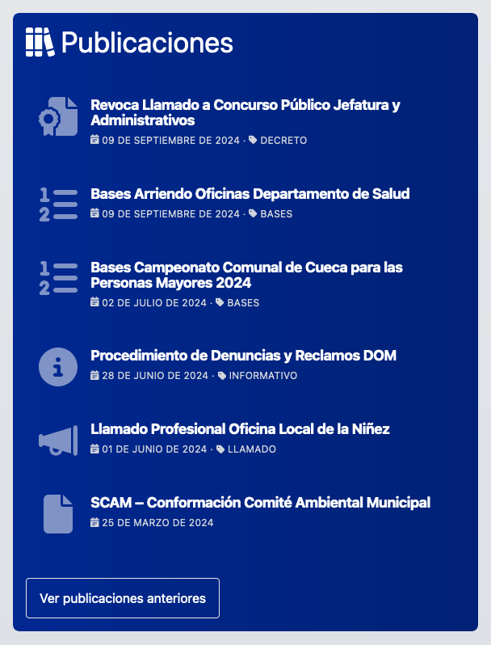
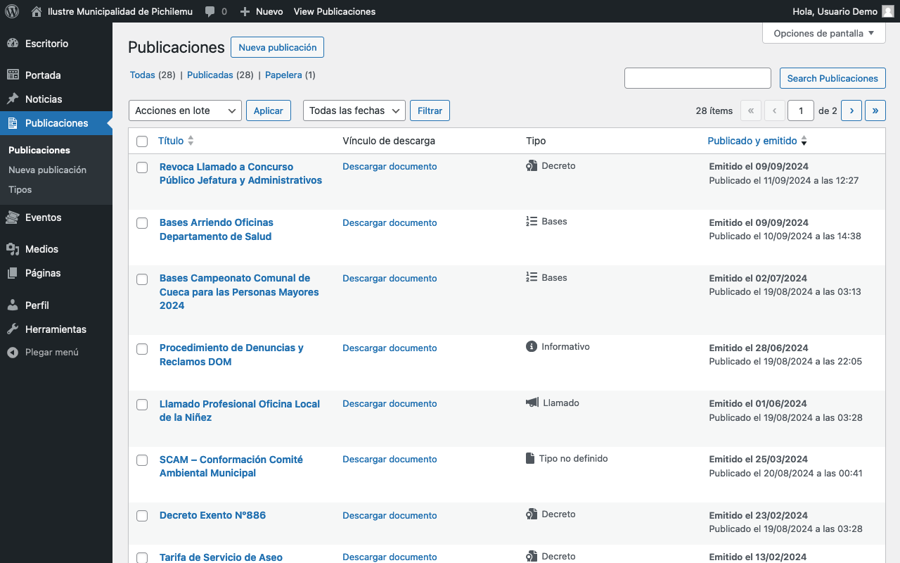
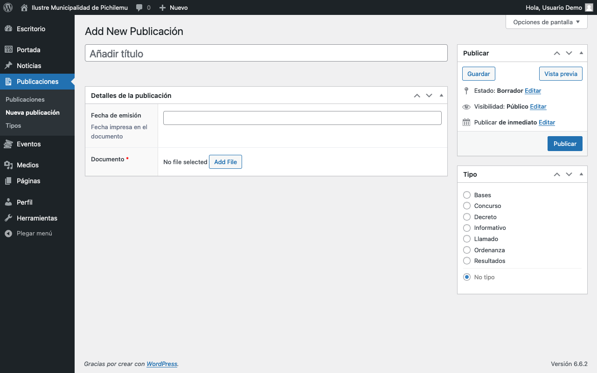
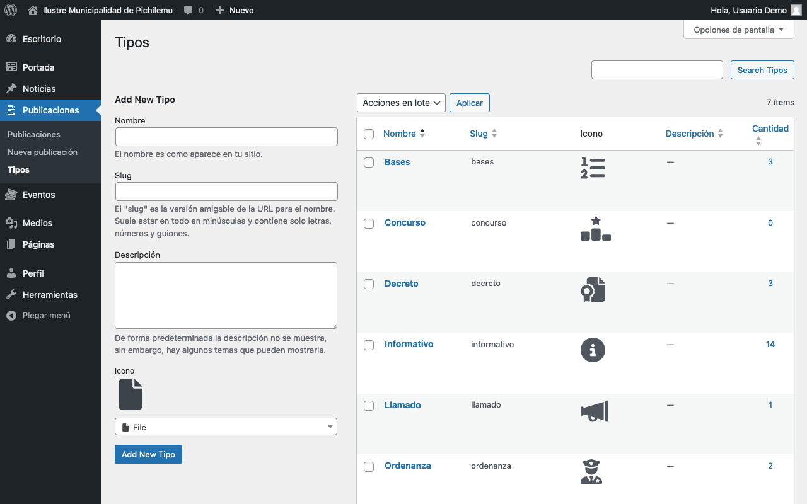

# Publicaciones

<figure><figcaption>
Listado de publicaciones en la página principal
</figcaption></figure>

El panel de administración de este elemento se encuentra en la barra lateral, bajo _Publicaciones_.

<figure><figcaption>
Listado de publicaciones en el mantenedor de Wordpress
</figcaption></figure>

## Agregar Publicación

Para agregar una nueva Publicación, sigue estos pasos:

1. Ve a _Publicaciones > Nueva publicación_ en el panel de administración.
2. Se abrirá el formulario para crear una nueva publicación.

<figure><figcaption>
Espacio de edición de una nueva publicación
</figcaption></figure>

### Campos específicos

#### **Título**

* **Descripción**: El nombre o título del documento.
* **Uso**: Introduce un título descriptivo y conciso en el campo _Añadir título._

#### **Fecha de emisión**

* **Descripción**: La fecha en que se emitió el documento.
* **Uso**: Introduce la fecha en el campo _Fecha de emisión_ bajo _Detalles de la publicación._
* **Nota**: Esta es la fecha impresa en el documento, no necesariamente la fecha de publicación en el sitio.

#### **Documento**

* **Descripción**: El archivo del documento que se está publicando.
* **Uso**:
  1. Haz clic en el botón _Add File_ bajo _Documento_.
  2. Sube el archivo del documento en formato PDF.
* **Nota**: Este campo es obligatorio.

#### **Tipo**

* **Descripción**: La categoría o tipo de documento.
* **Uso**: Selecciona el tipo apropiado del menú desplegable en el panel lateral derecho.
* **Importancia**: El tipo seleccionado determinará el icono que se mostrará junto al documento en el listado de publicaciones.

## Gestión de Tipos de Publicaciones

Los tipos de publicaciones determinan cómo se categorizan y visualizan los documentos en el sitio. Para gestionar los tipos:

1. Ve a _Publicaciones > Tipos_ en el panel de administración.
2. Aquí puedes ver, añadir, editar o eliminar tipos de publicaciones.

<figure><figcaption>
Vista del mantenedor rápido de tipos de publicaciones
</figcaption></figure>

### Añadir nuevo tipo

Para crear un nuevo tipo de publicación:

1. En la sección _Add New Tipo_, completa los siguientes campos:
   * **Nombre**: El nombre del tipo como aparecerá en el sitio.
   * **Descripción**: Una breve descripción del tipo (opcional).
   * **Icono**: Selecciona un icono representativo del menú desplegable.
2. Haz clic en _Add New Tipo_, para crear el nuevo tipo.

### Editar o eliminar tipos existentes

* Puedes editar los tipos existentes haciendo clic en su nombre en la lista.
* Para eliminar un tipo, usa la opción _Borrar_ que aparece al pasar el mouse sobre el nombre del tipo en la lista.

## Consejos para un uso efectivo

1. Asegúrate de que el título de la publicación sea claro y descriptivo.
2. Verifica que la fecha de emisión sea correcta, ya que esta información es importante para los usuarios.
3. Asegúrate de que los documentos subidos estén en un formato accesible.

## Notas adicionales

* Las publicaciones se mostrarán en el sitio web en una sección dedicada, **organizadas por fecha de emisión del documento**.
