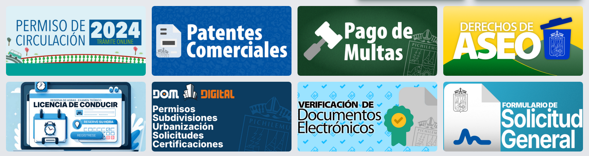
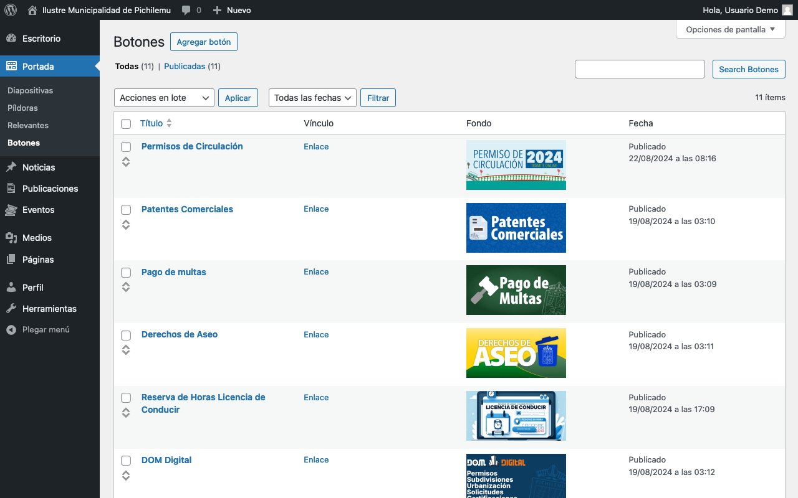
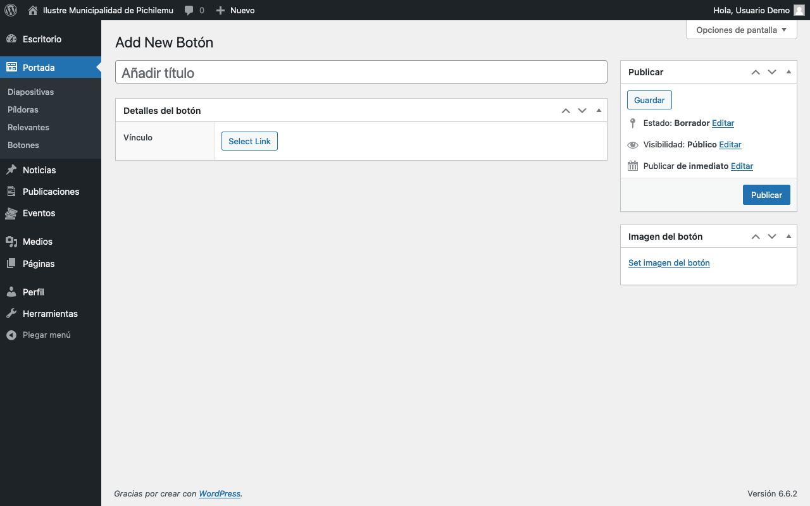
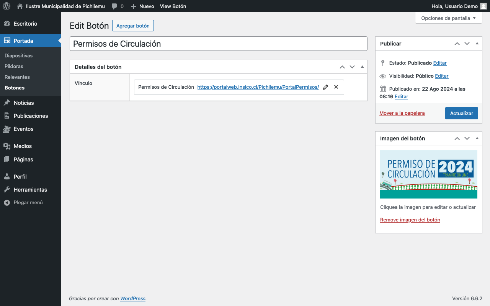

# Botones

<figure><figcaption>
Botones de trámites y servicios municipales
</figcaption></figure>

El panel de administración de este elemento se encuentra en la barra lateral, bajo _Portada > Botones_.

<figure><figcaption>
Lista del mantenedor de Botones
</figcaption></figure>

## Agregar Botón

Para agregar un Botón, hay que presionar el botón _Agregar botón_ en la parte superior del panel de administración.

<figure><figcaption>
Formulario para un nuevo Botón
</figcaption></figure>

### Campos específicos

#### **Título**

* Introduce un título descriptivo en el campo _Añadir título_.
* Este título es meramente referencial y no se mostrará en la página web.
* Sirve para identificar el botón en el panel de administración.

#### **Vínculo**

* En la sección _Información del botón_, encontrarás el campo _Vínculo_.
* Haz clic en _Select Link_ para añadir o editar el enlace al que llevará el Botón.
* Este enlace debe dirigir al trámite o servicio específico.

#### **Imagen destacada**

* En el panel lateral derecho, encuentra la sección _Imagen destacada_.
* Haz clic en _Establecer imagen destacada_ para subir o seleccionar una ilustración.
* Esta ilustración se mostrará como el botón en la portada.
* Asegúrate de que la ilustración sea coherente con el material gráfico promocional del trámite o servicio.

## Gestión de botones

Para gestionar los botones existentes:

1. Ve a _Portada > Botones_ en el panel de administración.
2. Verás una lista de todos los botones creados.
3. Puedes editar, eliminar o cambiar el orden de los botones desde esta pantalla.
4. Recuerda que solo los primeros 8 botones en la lista se mostrarán en la portada.

<figure><figcaption>
Editando un Botón
</figcaption></figure>

## Consejos para un uso efectivo

1. Prioriza los trámites y servicios más importantes en los primeros 8 lugares de la lista.
2. Usa ilustraciones claras y representativas que los usuarios puedan reconocer fácilmente.
3. Asegúrate de que los enlaces dirijan correctamente a los trámites o servicios correspondientes.
4. Revisa periódicamente la relevancia y el orden de los botones, ajustándolos según las necesidades actuales de los ciudadanos.
5. Considera la accesibilidad al elegir las ilustraciones, asegurándote de que sean comprensibles para todos los usuarios.
6. Aunque los títulos no se muestran en la web, úsalos de manera descriptiva en el panel de administración para facilitar la gestión interna y la accesibilidad.

## Notas adicionales

* Dado que los botones varían poco en el tiempo, es crucial elegir cuidadosamente qué trámites o servicios representar.
* La limitación de 8 botones visibles enfatiza la importancia de una selección y orden estratégicos.
* Considera realizar encuestas o analizar datos de uso para determinar qué trámites o servicios son más solicitados y que puedan requerir un botón en la portada.
* Coordina con el equipo de diseño para asegurar que las ilustraciones de los botones sean coherentes con la identidad visual de la municipalidad.
