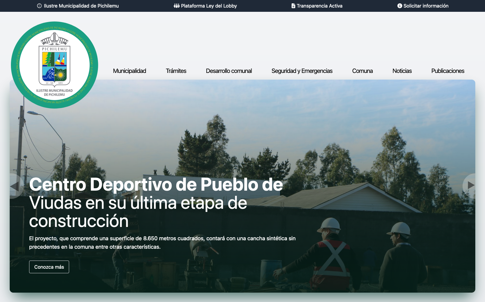
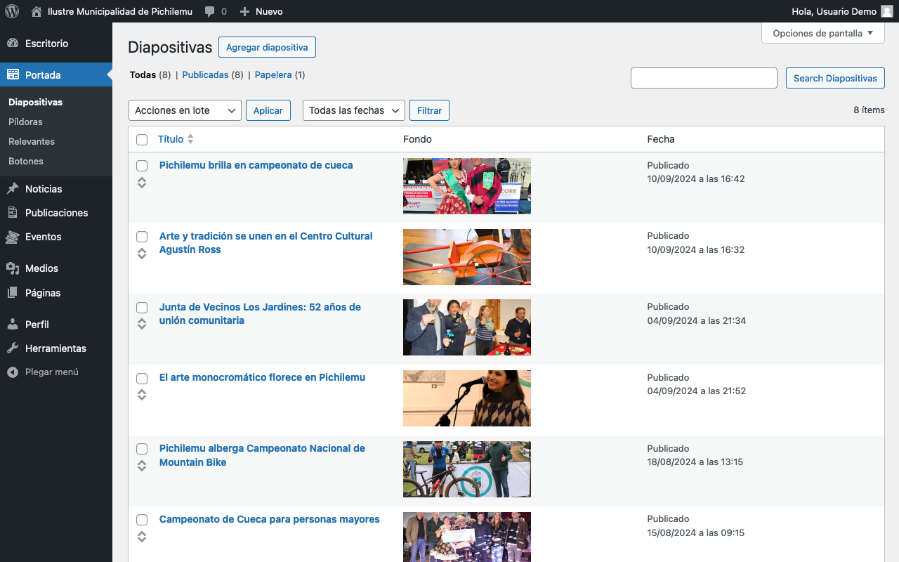
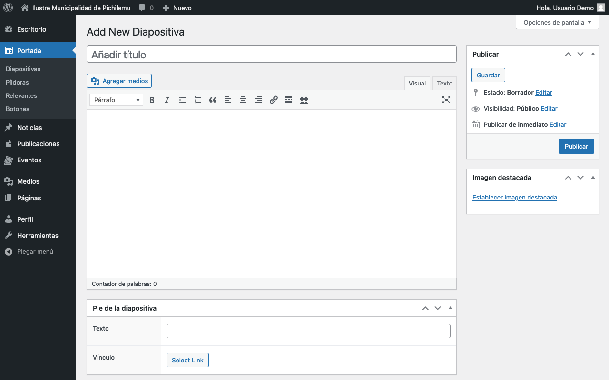
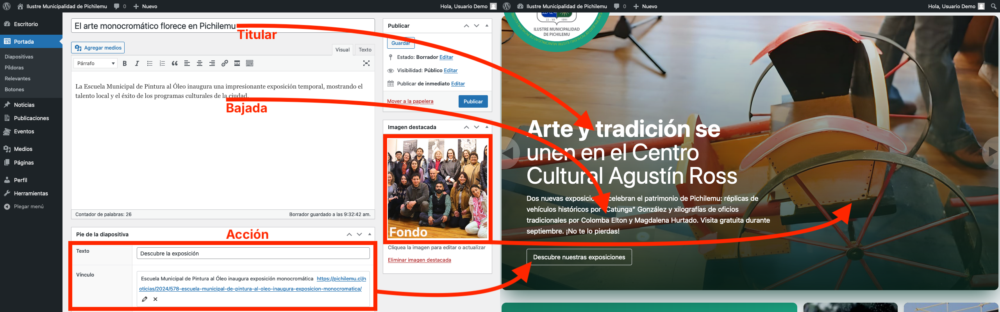
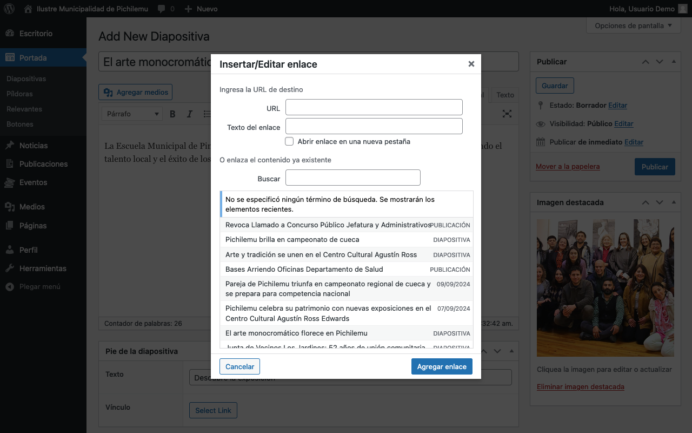
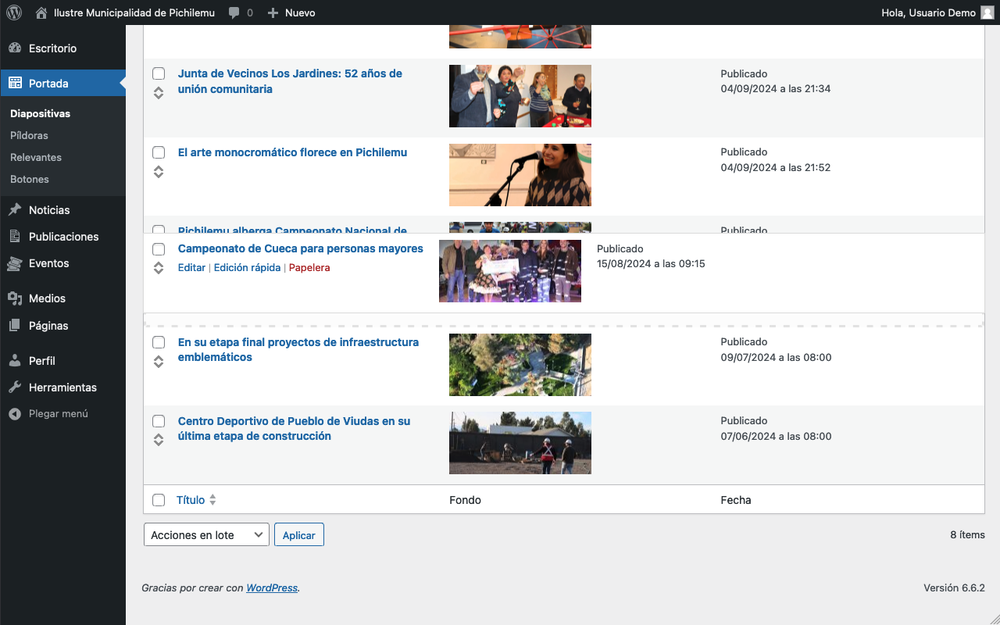

# Diapositivas

<figure><figcaption>
Vista de una Diapositiva en el sitio web, vista de Escritorio
</figcaption></figure>

El panel de administración de este elemento se encuentra en la barra lateral, bajo _Portada > Diapositivas_.

<figure><figcaption>
Listado de Diapositivas publicadas
</figcaption></figure>

## Agregar Diapositiva

Para agregar una Diapositiva, hay que presionar el botón _Agregar diapositiva_ en la parte superior del panel de administración.

<figure><figcaption>
Formulario de añadir diapositiva
</figcaption></figure>

### Campos específicos

<figure><figcaption>
Descripción de los campos del formulario
</figcaption></figure>

#### Titular

* **Descripción**: Es el título principal de la Diapositiva.
* **Características**:
  * Presenta dos pesos tipográficos dependiendo de la longitud del texto.
  * La primera línea siempre será en negrita.
  * El resto del texto se mostrará en peso regular.
* **Uso**: Escribe un título impactante y conciso. Considera cómo se dividirá el texto para aprovechar los diferentes pesos tipográficos.

#### Bajada

* **Descripción**: El contenido principal de la Diapositiva que se muestra debajo del titular.
* **Recomendación**: Mantén el texto por debajo de los 280 caracteres de longitud.
* **Uso**: Proporciona información adicional que complemente el titular y motive al usuario a tomar acción.

#### Acción (Vínculo)

* **Descripción**: Configura el botón que aparece al final de cada Diapositiva.
* **Características**:
  * Puede enlazar a cualquier lugar dentro o fuera del sitio web.
  * Es un elemento opcional.
  * No será visible si no se establece un vínculo.
* **Uso**:
  1. Establece el texto del botón en el campo _Texto_.
  2. Haz clic en el botón _Select Link_ en el campo _Vínculo._
  3. Se abrirá una ventana emergente _Insertar/Editar enlace_ con dos opciones principales:
     1. Configurar un vínculo manual:
        * En la parte superior, introduce la URL completa en el campo _URL_.
     2. Buscar y vincular contenido existente del sitio:
        * En la parte inferior, utiliza el campo _Buscar_ para encontrar contenido dentro de tu sitio.
        * Escribe palabras clave relacionadas con el contenido que deseas vincular.
        * Se mostrarán resultados de búsqueda con el título y tipo de contenido.
        * Selecciona el elemento deseado de la lista de resultados.
  4. Haz clic en _Agregar enlace_ para confirmar tu selección.
* **Nota**: Si no deseas mostrar un botón de acción, simplemente deja este campo en blanco.

<figure><figcaption>
Diálogo de inserción/edición de un enlace en el botón de Acción
</figcaption></figure>

#### Fondo

* **Descripción**: La imagen de fondo de la Diapositiva.
* **Configuración**: Se establece a través de las imágenes destacadas de WordPress.
* **Recomendaciones**:
  * Usa una imagen de **al menos 1920×1280px** (relación de aspecto 3:2).
  * Las imágenes ocuparán lo mejor posible el espacio visible de la diapositiva, tratando de cubrirla por completo.
  * **Importante**: Las imágenes están ancladas en su borde superior. Ubica los elementos relevantes de la imagen lo más arriba posible para garantizar su visibilidad.
* **Uso**: Selecciona "Establecer imagen destacada" en el panel lateral derecho para subir o elegir la imagen de fondo.

## Ordenar diapositivas manualmente

Puedes cambiar fácilmente el orden en que aparecen las diapositivas en la portada utilizando la función de arrastrar y soltar en la lista de diapositivas.

### Cómo ordenar las diapositivas:

1. Ve a la sección _Portada > Diapositivas_ en el panel de administración de WordPress.
2. Verás una lista de todas las diapositivas creadas, con su título, imagen de fondo y fecha de publicación.
3. A la izquierda de cada elemento de la lista, encontrarás un ícono de flechas.
4. Para cambiar el orden de una diapositiva:
   * Coloca el cursor sobre el ícono de flechas de la diapositiva que deseas mover.
   * Haz clic y mantén presionado el botón del mouse.
   * Arrastra la diapositiva hacia arriba o hacia abajo hasta la posición deseada.
   * Suelta el botón del mouse para colocar la diapositiva en su nueva posición.
5. El nuevo orden se guardará automáticamente.

### Consejos para ordenar diapositivas:

* Las diapositivas en la parte superior de la lista aparecerán primero en el carrusel de la portada.
* Considera colocar las diapositivas más importantes o urgentes al principio de la lista.
* Puedes reorganizar las diapositivas en cualquier momento para mantener el contenido de la portada actualizado y relevante.
* Si tienes muchas diapositivas, puedes usar la barra de desplazamiento a la derecha para navegar por toda la lista.

<figure><figcaption>
Reordenando diapositivas en el mantenedor
</figcaption></figure>

## Consejos para un uso efectivo

* Aprovecha los diferentes pesos tipográficos del titular para enfatizar palabras clave.
* Mantén la bajada concisa y complementaria al titular.
* Utiliza el botón de acción para guiar a los usuarios hacia contenido relevante o acciones deseadas.
* Selecciona imágenes de fondo que no dificulten la lectura del texto superpuesto.
* Al elegir o preparar imágenes de fondo, recuerda que se anclarán en la parte superior. Coloca los elementos visuales importantes en la mitad superior de la imagen para asegurar su visibilidad.
* Al configurar el vínculo de la diapositiva, considera si es más apropiado enlazar a contenido interno del sitio (usando la búsqueda) o a recursos externos (introduciendo la URL manualmente).
* Asegúrate de que el texto del enlace (si lo proporcionas) sea descriptivo y coherente con el contenido al que se dirige.

## Notas adicionales

* El tiempo de rotación entre diapositivas está preconfigurado. Si necesitas ajustarlo, contacta con el administrador del sitio.
* La rotación de las diapositivas se pausará al posar el mouse sobre el carrusel.
* Asegúrate de que todas las diapositivas tengan un enlace válido para evitar la frustración del usuario.
