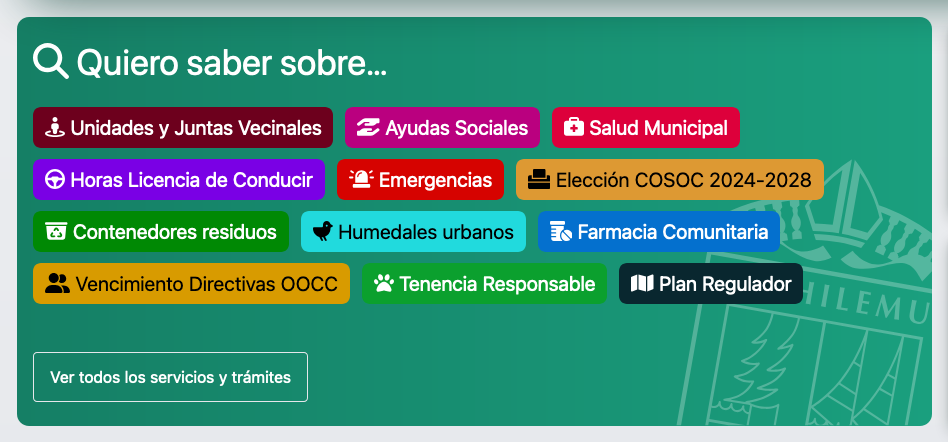
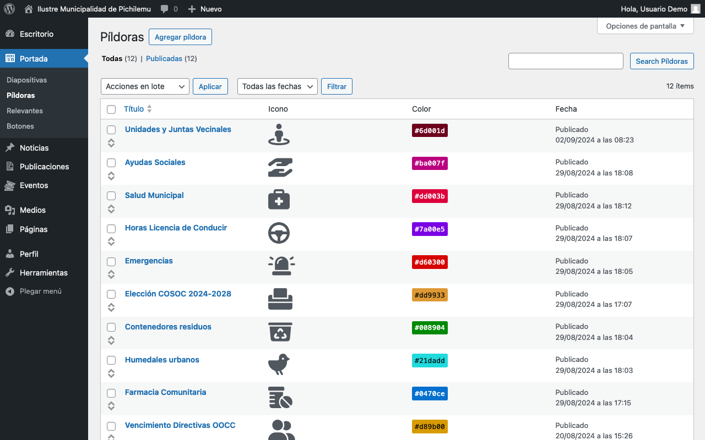
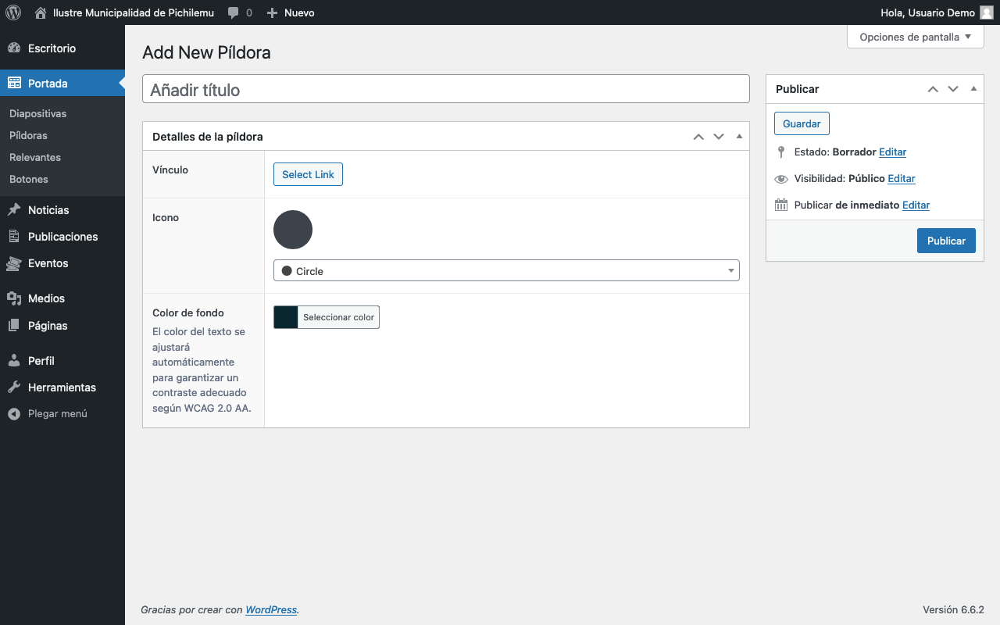
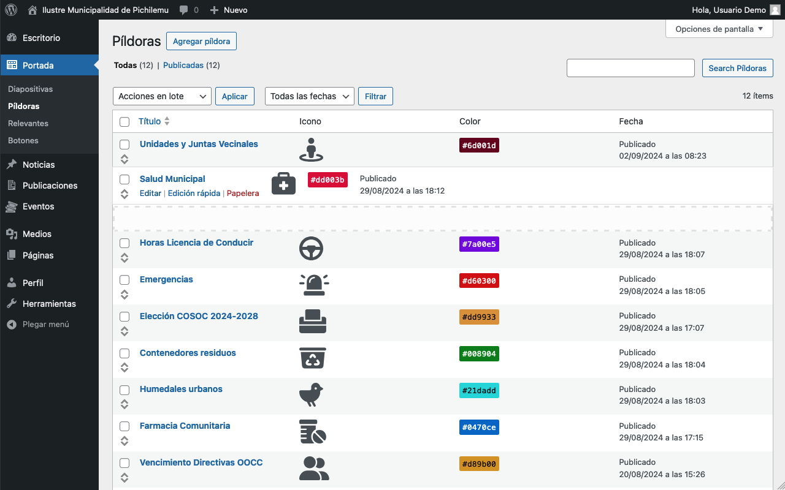

# Píldoras

<figure><figcaption>
La sección <em>Quiero saber sobre…</em> muestra el contenido de las píldoras
</figcaption></figure>

El panel de administración de este elemento se encuentra en la barra lateral, bajo _Portada > Píldoras_.

<figure><figcaption>
Listado de píldoras
</figcaption></figure>

## Agregar Píldora

Para agregar una Píldora, hay que presionar el botón _Agregar píldora_ en la parte superior del panel de administración.

<figure><figcaption>
Formulario para nuevas píldoras
</figcaption></figure>

### Campos específicos

#### Título

* **Descripción**: El texto principal que aparecerá en la píldora.
* **Uso**: Escribe un título breve y descriptivo. Se recomienda mantenerlo bajo 50 caracteres para una mejor visualización.

#### Vínculo

* **Descripción**: La URL a la que se dirigirá al usuario cuando haga clic en la píldora.
* **Uso**:
  1. Haz clic en el botón _Select Link_.
  2. Puedes introducir una URL externa o buscar contenido interno del sitio.
  3. Asegúrate de que el enlace sea relevante y esté activo.

#### Icono

* **Descripción**: Un icono visual que acompaña al título de la píldora.
* **Fuente**: Los iconos disponibles son de [Font Awesome](https://fontawesome.com/), una biblioteca de iconos ampliamente utilizada.
* **Uso**:
  1. Haz clic en el menú desplegable bajo _Icono_.
  2. Verás una lista buscable de iconos disponibles. Los nombres de los iconos están en inglés.
  3. Selecciona un icono apropiado de la lista (por ejemplo, _Circle_ en la imagen).
  4. El icono seleccionado se mostrará en la previsualización sobre el menú desplegable.
* **Consejos**:
  * Familiarízate con los nombres en inglés de los iconos comunes que podrías utilizar frecuentemente.
  * Si no estás seguro del nombre en inglés, puedes probar diferentes opciones y ver la previsualización para encontrar el icono deseado.
  * Considera tener a mano [una referencia visual de los iconos de Font Awesome](https://fontawesome.com/icons) para facilitar la selección.
* **Nota**: Elige un icono que sea intuitivo y se relacione claramente con el contenido de la píldora para mejorar la experiencia del usuario.

#### Color de fondo

* **Descripción**: El color de fondo de la píldora.
* **Uso**:
  1. Haz clic en el botón _Seleccionar color_.
  2. Elige un color del selector que se abre.
* **Nota importante**: El color del texto se ajustará automáticamente para garantizar un contraste adecuado según las pautas de accesibilidad WCAG 2.0 AA.

## Gestión de píldoras

Para gestionar las píldoras existentes:

1. Ve a _Portada > Píldoras_ en el panel de administración.
2. Verás una lista de todas las píldoras creadas.
3. Puedes editar, eliminar o cambiar el orden de las píldoras desde esta pantalla.

<figure><figcaption>
Las píldoras pueden ser reordenadas usando el icono a la izquierda de cada elemento
</figcaption></figure>

## Consejos para un uso efectivo

1. Mantén el número de píldoras limitado para evitar una sobrecarga de elementos visuales.
2. Utiliza títulos cortos y descriptivos para una rápida comprensión por parte del usuario.
3. Elige iconos que sean intuitivos y se relacionen claramente con el contenido de la píldora.
4. Recuerda que el icono es un complemento visual. El título de la píldora debe ser suficientemente descriptivo por sí solo.
5. Actualiza regularmente las píldoras para reflejar la información más relevante o los enlaces más utilizados.
6. Considera usar píldoras para:
   * Enlaces a servicios municipales en línea
   * Información de contacto importante
   * Recursos comunitarios frecuentemente accedidos

