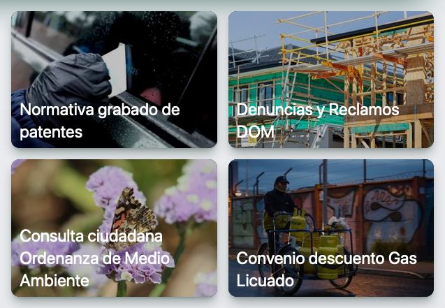
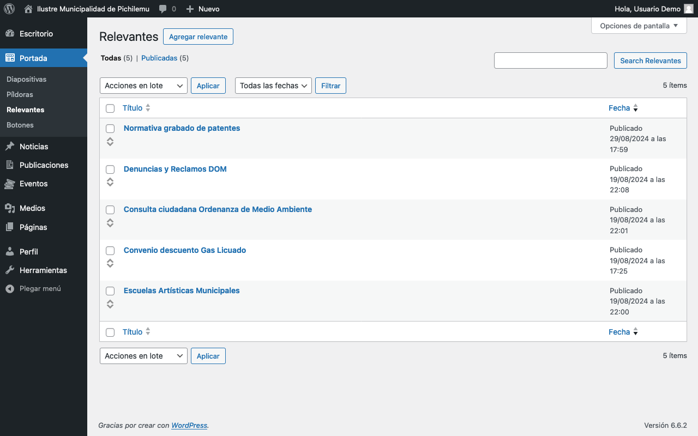
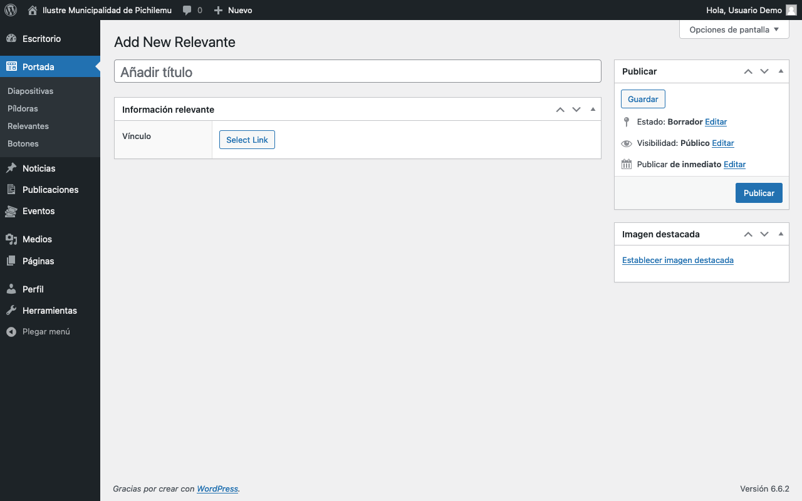
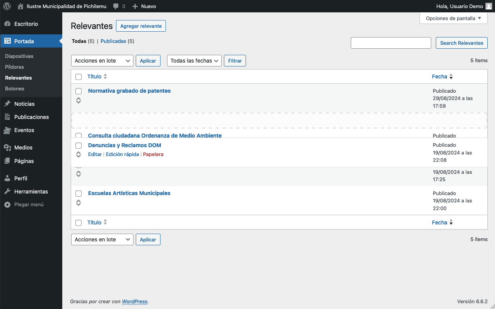

# Relevantes

<figure><figcaption>
Apariencia de los cuadros Relevantes en el sitio web
</figcaption></figure>

El panel de administración de este elemento se encuentra en la barra lateral, bajo _Portada > Relevantes_.

<figure><figcaption>
Relevantes en el mantenedor de Wordpress
</figcaption></figure>

## Agregar Relevante

Para agregar un Relevante, hay que presionar el botón _Agregar relevante_ en la parte superior del panel de administración.

<figure><figcaption>
Formulario de creación de un Relevante
</figcaption></figure>

### Campos específicos

#### **Título**

* Introduce un título descriptivo en el campo _Añadir título_.
* Este será el texto principal que se mostrará para el Relevante.

#### **Vínculo**

* En la sección _Información relevante_, encontrarás el campo _Vínculo_.
* Haz clic en _Select Link_ para añadir o editar el enlace al que llevará el Relevante.

#### **Imagen destacada**

* En el panel lateral derecho, encuentra la sección _Imagen destacada_.
* Haz clic en _Establecer imagen destacada_ para subir o seleccionar una imagen.
* Esta imagen se mostrará como fondo del Relevante en la portada.

## Gestión de relevantes

Para gestionar los relevantes existentes:

1. Ve a _Portada > Relevantes_ en el panel de administración.
2. Verás una lista de todos los relevantes creados.
3. Puedes editar, eliminar o cambiar el orden de los relevantes desde esta pantalla.
   * Considera que solo se mostrarán en la portada los primeros 4 elementos de la lista.

<figure><figcaption>
Los Relevantes también son reordenables, aunque solo se muestran los 4 primeros de la lista
</figcaption></figure>

## Consejos para un uso efectivo

1. Mantén los títulos muy breves, ya que el espacio disponible es pequeño.
2. Usa imágenes destacadas que sean relevantes y atractivas visualmente.
3. Asegúrate de que los enlaces sean correctos y estén actualizados.
4. Revisa y actualiza los Relevantes regularmente para mantener la información al día.
5. Utiliza los Relevantes para destacar información crítica, eventos importantes o servicios nuevos.
